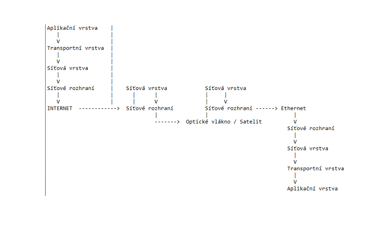

# Web Development

## Frontend
    a) HTML, CSS, JavaScript + responsive web design
    b) external API google maps, fonts, banking
    c) Frameworks (React, Angular, Vue, Bootstrap, Materialize, etc.)

## Backend
    a) DB's => SQL (MySQL, PostgreSQL, SQLite, etc.) + NoSQL (MongoDB, Firebase, etc.)
    b) PHP, Python, Java, C#, ASP, Node etc.

## TCP/IP Architecture
 - Transmission Control Protocol / Internet Protocol
 - Transmission protocol / layer of internet protocol
 - set of rules for communication



 -Application Layer = data
 -Transport Layer(source port and destination port) = header + data
 -Source IP address and destination IP address = header + data (Internet Layer)
 
 -activity of HTTP = request/response => Communication between client and server

#### client
  - browser or application(robot, spider, etc.)

#### web server(http)
    - Application that is running on a server or cloud(Apache, Nginx, IIS, etc.)

#### request
    - pure text containing information about the client and the request(doc type, browser info, etc.)
#### response 
    - server responds in the header if the request was successful or not and after that it sends the data

#### http 
    - stateless protocol
    - cant keep track of history
    - thus they made cookies

#### cookies
    - small text files that are stored on the client side
    - they are used to store information about the client and the server communication etc.

## HTML
    - HyperText Markup Language
    - Marks are being called tags
    - tag can be unclosed or closed
    - it has hierarchic structure = parent-child relationship

### HTML tags

``` html
<!DOCTYPE html>
<html>
    <head> (meta data about the document. user should not see it)
        <title>Page Title</title>
    </head>
    <body>
        <header> </header> (basic layout of the page)
    </body>
</html>
```

#### head tag
    - contains meta data about the document
    - user should not see it
    - title, meta, link, style, script, base
    - title = title of the page
    - meta charset = utf-8 sets the character encoding
    - meta name=“keywords“ content = “HTML, CSS, JavaScript" = keywords that describe the content of the page (SEO)
  
## DNS
    - Domain Name System
    - translates domain names to IP addresses
    - DNS server = server that has a database with domain names and IP addresses
    - DNS client = browser or application that is requesting the IP address of a domain name
    - DNS query = request for the IP address of a domain name
    - DNS response = IP address of the domain name